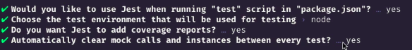

# Testing Node Applications

Please, you may [click here](./tests.pdf) to find out extra details of this topic.

## Types of testings

### Unit tests

It tests a pure and minimum function, which does not perform side effects such as DB accessing or external integrations;

### Integration testings

It is the main est for back-end. It tests complete functionalities such as routes till the controller return.
(mocks = fakes functionalities)

### E2E testing

Testing of interfaces which simulates the user (generally for front-end). It tests the flow of application.

### TDD - Test Driven Development

- It creates tests before the functionalities (it is kind a to-do list for the development);
- It facilitates the visualiation of the business rules;
- The process of this kind of development is based on three steps: **RED ➡ GREEN ➡ REFACTOR**

1. Red: It means the implementation of tests however it will not pass because we don't have the functionality yet;
2. Green: Our goal is to develop the functionality not worrying about the code quality, but only to pass the test implemented at the first/red step;
3. Refactor: Finally we will take care of the quality of the code in order to improving it.

# Jest

- It can be implemented in Node / React / React Native's apps;
- It is a testing framework from Facebook;
- Code Coverage integrated;
- Multi-thread integrated (uses more than 1 thread from processor improving the spped of tests);

# Configuring the project

## Using @rocketseat/omni for project creation

In order to automate the process of creating a new Node's project, we will use a lib which is a CLI that creates projects (Node/React/ReactNative) based on the resources which we hav implemented before.

`yarn global add @rocketseat/omni`

For new project: `omni init projectName --onlyserver` (`--onlyserver` will create a Node project. If you do not put anything, it will create a Node/React/ReactNative project at once).

## Configuring JEST

Install it `yarn add jest -D`, afterwards run `yarn jest --init` and answer the following questions:



It has created [jest.config.js](./project/jest.config.js) and let's make some changes:

1. `bail: 1` (if have some error in a tet, it will stop immediately);
2. `collectCoverage: true`;
3. `collectCoverageFrom: ['src/app/**/*.js']` (where are the codes swhich will be tested. It is not necessary another files such as app.js, routes.js and server.js. `**` means every folder);
4. `coverageReporters: [ "text","lcov"],`;
5.

```javascript
testMatch: [
    "**/__tests__/**/*.test.js",
  ],
```

(the place which the script tests will be stored. In this case the script tests will be stored at `/__tests__/` and the suffix name will be `<something>.test.js`);

By default, Jest will perform it tests using commonJS scripts, like `require()`, and not `import {} from ''` that we are using till now. To fix this, we can install a functionality from **sucrase**: `yarn add @sucrase/jest-plugin -D`. And within [jest.config.js](./project/jest.config.js) replace `transform` to the following code:

```javascript
transform: {
  ".(js|jsx|ts|tsx)": "@sucrase/jest-plugin"
},
```

Finally, we will open [nodemon.js](./project/nodemon.js) and add the following line in order to Nodemon not reload the application every time we change some script test in `__tests__` folder:

```json
{
  "execMap": {
    "js": "sucrase-node"
  },
  "ignore": ["__tests__"]
}
```

## Creating first test code

Before create our first test script, let's install a dependency which will make the Intellisense to show the codes: `yarn add -D @types/jest`.

Within `__tests__` folder, let's create [example.test.js](./project/__tests__/example.test.js).

## Test() function

This command will indicate whether some function passes the test:

```javascript
// let's test the follow function
function sum(a, b) {
  return a + b;
}

test("if I call sum() function with 4 and 5 it should return 9", () => {
  const result = sum(4, 5);

  expect(result).toBe(8); // testing if expected result will be 9
});
```

Running `yarn test` it will execute each test within `__tests__` folder and will return the results.

After running the tests, it will be created `coverage` folder, which is an user-friendly interface from coverage test. Let's configure [jest.config.js](./project/jest.config.js) at the following line code to create this folder in `__tests__` folder:

```javascript
coverageDirectory: "__tests__/coverage";
```
